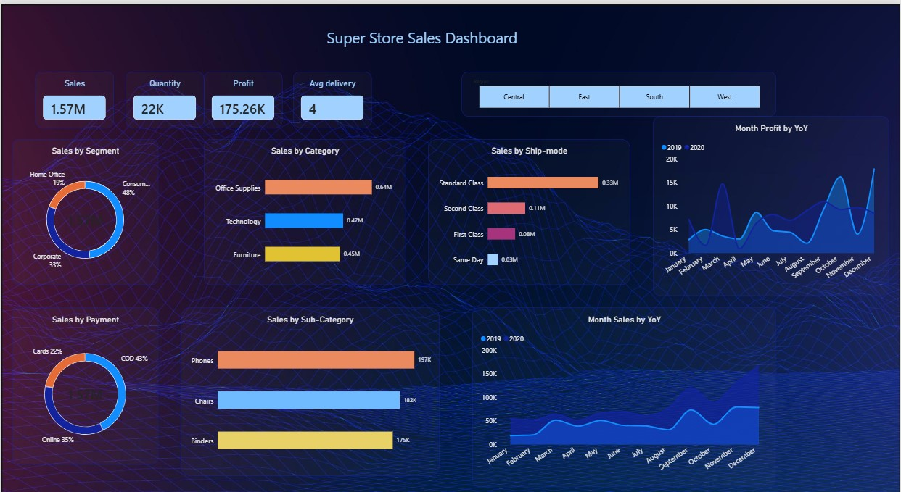

# 📊 Super Store Sales Dashboard | Power BI

An interactive **Super Store Sales Dashboard** built using **Microsoft Power BI** to analyze sales, profit, customer segments, product categories, shipping modes, payment methods, and year-over-year performance.

The project started with raw sales data, which was cleaned and transformed using **Power Query** before building an interactive dashboard with Power BI visuals, KPIs, filters, and analytical measures.

---

## 📌 Project Overview

The objective of this project was to transform raw Super Store sales data into an interactive business intelligence dashboard that can help users quickly understand:

- Overall Sales Performance
- Total Profit
- Total Quantity Sold
- Average Delivery Time
- Sales by Region
- Sales by Customer Segment
- Sales by Category
- Sales by Sub-Category
- Sales by Ship Mode
- Sales by Payment Mode
- Monthly Sales Trends
- Monthly Profit Trends
- Year-over-Year (YoY) Performance

---

## 🛠️ Tools & Technologies

- **Microsoft Power BI**
- **Power Query**
- **DAX**
- **Data Cleaning & Transformation**
- **Data Visualization**
- **Interactive Filters / Slicers**
- **Business Intelligence**
- **Data Analysis**

---

## 🧹 Data Cleaning & Transformation

The raw dataset was processed in **Power Query** before creating the dashboard.

### Cleaning & Preparation Steps

- Imported raw CSV data into Power BI
- Reviewed the dataset structure and columns
- Corrected data types
- Cleaned date columns
- Prepared Order Date and Ship Date for analysis
- Handled missing/null values
- Removed unnecessary fields where required
- Prepared categorical and numerical columns
- Transformed the data for visualization
- Used Power Query transformation features including:
  - Filtering
  - Data type conversion
  - Null/missing value handling
  - Column transformations
  - Pivot / Unpivot operations where required

---

## 📈 Dashboard KPIs

The dashboard provides high-level KPIs including:

| KPI | Value |
|---|---:|
| Total Sales | 1.57M |
| Total Quantity | 22K |
| Total Profit | 175.26K |
| Average Delivery | 4 Days |

These KPIs provide a quick overview of the overall business performance.

---

## 📊 Dashboard Visualizations

### Sales Analysis

- Sales by Segment
- Sales by Category
- Sales by Ship Mode
- Sales by Sub-Category
- Sales by Payment Mode
- Monthly Sales Trend

### Profit Analysis

- Monthly Profit Trend
- Year-over-Year Profit Comparison

### Business Dimensions

- Region
- Customer Segment
- Product Category
- Product Sub-Category
- Ship Mode
- Payment Mode

---

## 🎛️ Interactive Features

The dashboard is interactive and allows users to analyze the data dynamically.

### Region Filter

Users can filter the dashboard by:

- Central
- East
- South
- West

The visuals update according to the selected region.

### Cross-Filtering

Selecting a category, segment, region, or other visual element dynamically affects related visuals, making it easier to explore the data.

---

## 📅 Year-over-Year Analysis

The dashboard includes Year-over-Year analysis to compare business performance across different years.

The following trends are analyzed:

- Monthly Sales YoY
- Monthly Profit YoY

This helps identify changes in sales and profitability over time.

---

## 📊 Key Business Insights

Some important observations from the dashboard include:

- Office Supplies generates the highest sales among the three major categories.
- Consumer represents the largest customer segment.
- Standard Class is the most commonly used shipping mode.
- COD represents the largest share among the available payment methods.
- Monthly sales and profit fluctuate throughout the year.
- YoY analysis helps identify periods of stronger and weaker performance.

---

## 🎯 Business Objective

The main objective of this dashboard is to convert raw transactional data into an easy-to-understand business intelligence solution.

It can help business users:

- Monitor sales performance
- Track profitability
- Identify high-performing categories
- Understand customer segments
- Analyze shipping preferences
- Compare yearly performance
- Identify monthly sales trends
- Make data-driven decisions

---

## 🧠 Skills Demonstrated

This project demonstrates practical experience in:

- Data Cleaning
- Data Transformation
- Power Query
- DAX
- Data Modeling
- KPI Development
- Data Visualization
- Interactive Dashboard Development
- Trend Analysis
- YoY Analysis
- Business Intelligence
- Data Storytelling

---

## 📁 Dataset

The project uses a Super Store sales dataset containing transactional information such as:

- Order ID
- Order Date
- Ship Date
- Ship Mode
- Customer ID
- Customer Name
- Segment
- Country
- City
- State
- Region
- Product ID
- Category
- Sub-Category
- Product Name
- Sales
- Quantity
- Profit
- Returns
- Payment Mode

---

## 🖼️ Dashboard Preview

---

## 🚀 Project Outcome

This project demonstrates the complete workflow of a Power BI data analytics project:

**Raw Data → Data Cleaning → Data Transformation → Data Analysis → DAX Measures → Visualization → Interactive Dashboard**

The final dashboard provides a centralized view of sales and profitability performance and allows users to explore the data interactively.

---

## 👨‍💻 Author

**Ahmed Ali**

Aspiring Data Analyst | Power BI | SQL | Excel | Data Analytics
